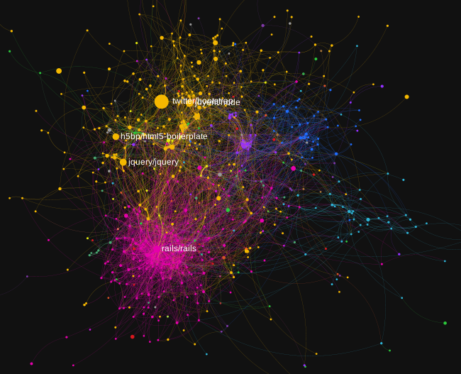

GitHub Repository Collaboration Network Analysis
===

An analysis and visualization of collaboration between top GitHub repositories,
focused on the relationship between programming languages used and the network
structure.

**Interactive visualization:**

General workflow
---

 * From Google BigQuery:
    * repo-attributes.sql creates repo-attributes.csv
    * repo-weights.sql creates repo-weights.csv
 * The process.py script reads both .csv files and creates repositories.gml
 * Gephi loads repositories.gml and creates:
    * repositories\*.pdf 
    * [repositories.json](https://github.com/shivanXI/github_analysis/blob/master/repositories.json) for sigma.js
 * Python code within analysis-\*.texw reads repositories.gml and produces
   output 